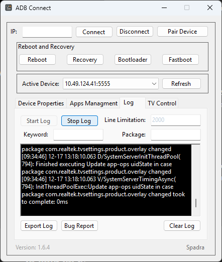
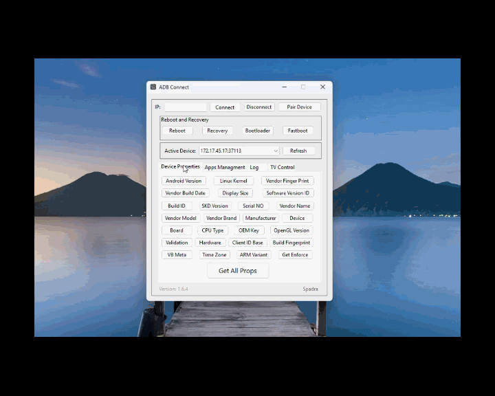

# Screenshots

Visual assets used in the ADB Connect README and Release Notes.
## Preview

### Application overview

### Wireless Debugging pairing

### App Managment Tab

### Log Tab

### TV Control Tab

### Quick demonstration

